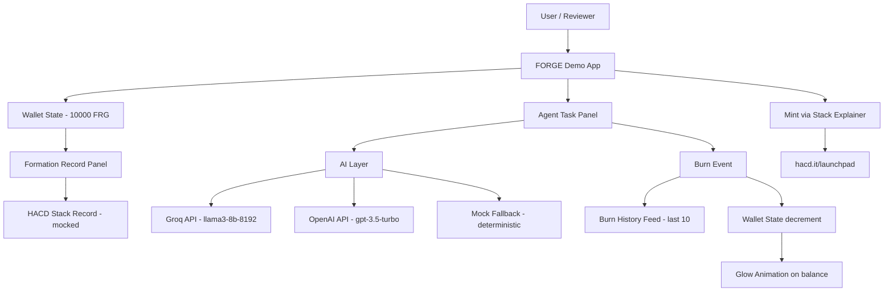

<p align="center">
  

</p>

# FORGE (FRG) — PoW-Backed AI Agent Compute Token on HACD Stack

[](project_frg/launch_spec.json)
[](https://hacd.it/incubator)
[](project_frg/launch_spec.json)

**Built for HACD Labs Incubator Cohort 2**

FORGE (FRG) is a PoW-backed AI agent compute token formed through the HACD Stack protocol. Every FRG token has an immutable on-chain formation origin — each batch required a PoW-mined HACD unit and a 50 HAC stack cost. 1 FRG = 1 prepaid AI agent task run. Tokens burn on use. New supply enters only through HACD Stack minting. This demo lets a reviewer watch that entire loop in under 60 seconds.

## At A Glance

- Define a task. Paste any text you want summarized.
- Click once. Watch 1 FRG burn and the AI execute.
- See the formation record — where this wallet's FRG came from, permanently.
- Watch the burn history feed grow in real time, newest first.
- Read how new FRG can only enter supply through HACD Stack minting. No free minting.

## Live Demo

- **Demo app:** `npm install && npm run dev` → `http://localhost:5173/`
- **Launchpad:** [hacd.it/launchpad](https://hacd.it/launchpad)
- **Incubator submission:** [hacd.it/incubator](https://hacd.it/incubator)
- **Issuance package:** `project_frg/` — 8 validated documents
- **Validator:** `py scripts/validate_launch_spec.py project_frg/launch_spec.json --strict`
- **Expected output:** 0 errors, 2 warnings (`issuer_confirmed` + `hacd_labs_reviewed` = false in draft)

## Validation

```
py scripts/validate_launch_spec.py project_frg/launch_spec.json --strict

ERRORS: 0 [OK]

WARNINGS (2):
  [!] compliance.issuer_confirmed = false — issuer must confirm parameters before publication
  [!] compliance.hacd_labs_reviewed = false — HACD Labs must review before publication

Result: 0 error(s), 2 warning(s) — PASSED
```

## Problem Statement

AI compute credits are a soft promise.

Today, if a developer or agent runtime needs compute access tokens, those tokens can be freely minted, rebased, or diluted at will by the issuer. There is no mechanism to verify the supply origin. There is no audit trail of when a batch was created. There is no cost anchor that makes arbitrary pre-minting impossible.

The gaps are structural:

- Compute credit supply can be inflated without any on-chain evidence.
- There is no way to verify that a token batch was not secretly pre-minted before launch.
- Formation timestamps can be falsified in any system that does not anchor them to PoW.
- AI agents have no native access to compute credits with verifiable, energy-anchored origins.
- Burn-on-use tokens have no credible supply model if issuance is free and uncapped.

The result: AI compute credits that claim scarcity but have no structural mechanism to enforce it.

## Our Solution

FORGE uses HACD Stack to make every FRG token's origin verifiable and permanent.

Each FRG batch is formed through a two-input cost structure: a PoW-mined HACD unit (the container) and a 50 HAC stack cost (the formation cost). Both inputs are on-chain and public. The formed-at timestamp is sealed by the Hacash chain and cannot be backdated or altered. Supply is capped at 200 HACD lots — enforced by HACD unit scarcity, not governance promises.

When an AI agent task runs, 1 FRG burns permanently. New supply can only enter through additional HACD Stack formation. The loop is: real energy expenditure → formation → spend → burn.

The core idea: compute credits whose supply origin you can read from the chain, not trust from the issuer.

## Key Features

- PoW-anchored supply origin via HACD Stack — no free minting, ever.
- Burn-on-use mechanics — 1 FRG = 1 AI agent task, consumed on execution.
- Live balance counter with glow animation on each burn event.
- Formation Record panel — always visible, shows the on-chain story of this wallet's FRG.
- Burn History feed — last 10 burns, newest first, with timestamp, snippet, AI output, and tx hash.
- Real AI integration — Groq (llama3-8b-8192) → OpenAI (gpt-3.5-turbo) → mock fallback chain.
- "Mint via Stack" educational explainer — 3-step visual of how new FRG enters supply.
- Deterministic HACD name generation from the 16-letter PoW charset.
- Fully responsive — 3-column desktop, single-column mobile.
- `prefers-reduced-motion` support — animations skip when the system preference is set.

## Architecture Overview



### 1. User Layer

The reviewer opens the app and sees the FRG balance, Formation Record, and task input without scrolling. One click starts the formation moment demonstration.

### 2. Formation Layer

The Formation Record panel displays the HACD Stack origin of the demo wallet's FRG — HACD name, formed-at timestamp, stack cost, and FRG from that lot. This is always visible and never hidden behind a modal or tab.

### 3. AI Execution Layer

When the user clicks "Run Agent Task", the app calls Groq (if a key is set), falls back to OpenAI, then falls back to a deterministic mock summary. All three paths produce the same data shape and display the same burn event structure.

### 4. Burn and State Layer

Each task execution decrements the FRG balance by exactly 1, creates a BurnEvent with a real timestamp and a random 64-hex tx hash, and prepends it to the Burn History feed (max 10 entries).

### 5. Supply Education Layer

The "Mint via Stack" panel at the bottom explains the 3-step formation process: acquire HACD → pay 50 HAC → 10,000 FRG formed. Static, educational, no live transaction required.

## Workflow

1. App loads — Formation Record is visible within 2 seconds.
2. Reviewer reads the HACD Stack origin (HACD name, formed-at, stack cost, FRG lot).
3. Reviewer pastes or types text into the Agent Task input.
4. Reviewer clicks "Run Agent Task (burn 1 FRG)".
5. Button shows loading state — "Running... burning 1 FRG".
6. AI layer executes (Groq, OpenAI, or mock).
7. FRG balance decrements by 1 with a glow animation on the counter.
8. A new Burn Event appears at the top of the history feed:
   - Timestamp (now)
   - Task: summarize
   - Input snippet (first 60 chars)
   - AI summary output
   - `−1 FRG burned · tx: abc123...def456`
9. Total burned and tasks run counters update.
10. Reviewer scrolls to the bottom to see the "Mint via Stack" panel.

The entire loop — formation record → task → burn → history — is visible in under 60 seconds.

## Architectural Diagram Notes

The architecture is intentionally minimal for the sprint scope.

- The frontend owns all state and logic — no backend required for the demo.
- The AI layer is a pure fallback chain: real APIs when keys are present, mock when not.
- The Formation Record is computed deterministically from the wallet address — same address, same HACD name, every time.
- The "Mint via Stack" panel is static copy — it explains the real protocol without simulating a live transaction.

## Tech Stack

- **Frontend:** Vite + Vanilla JS (no framework dependency)
- **Styling:** Vanilla CSS with CSS custom properties (no Tailwind)
- **Fonts:** Space Grotesk (headings), Inter (body), JetBrains Mono (numbers, hashes, timestamps) via Google Fonts
- **AI:** Groq API (llama3-8b-8192) → OpenAI API (gpt-3.5-turbo) → deterministic mock
- **Blockchain layer:** HACD Stack (Hacash mainnet — mocked for demo)
- **Validation:** Python 3 script (`scripts/validate_launch_spec.py`)
- **Issuance package:** 8 Markdown + JSON documents in `project_frg/`

## HACD Stack — Formation Record

> **Formation: mocked for demo. No real on-chain transactions. Real stacking requires a PoW-mined HACD unit and 50 HAC stack cost.**

- **Demo wallet:** `1HacashFRGDemoWallet9B8FE8Stack2Cohort2xZ`
- **HACD name:** Deterministically generated from wallet address using the 16-letter charset `WTYUIAHXVMEKBSZN`
- **Formed at:** `2025-11-14T09:23:07Z` (mocked)
- **Stack cost:** 50 HAC
- **FRG from this lot:** 10,000
- **Formation status:** `formation: mocked for demo`

Formation logic overview:

- A HACD unit is PoW-mined with a unique 6-letter name from the charset. Each name is permanent and on-chain.
- The stacker pays 50 HAC as the stack cost via the Hacash Launchpad.
- 10,000 FRG are formed on-chain and credited to the stacker's wallet.
- The formed-at timestamp is sealed by the Hacash chain and cannot be altered.
- Stack removal disables the formation record for that lot.

Real stacking:

- **Launchpad:** [hacd.it/launchpad](https://hacd.it/launchpad)
- **Network:** Hacash Mainnet
- **HACD charset:** `WTYUIAHXVMEKBSZN` (16 letters, PoW-mined names only)

## FRG Token — FORGE

FRG is the native compute credit of the FORGE AI agent task protocol, formed through HACD Stack.

**Asset type:** Fungible Token (FT)
**Maximum supply:** 2,000,000 FRG
**Formation mechanism:** HACD Stack (Hacash Mainnet)

### Token Utility

| Utility | Description |
| :--- | :--- |
| AI agent task execution | 1 FRG = 1 prepaid task run (summarize, classify, transform). Consumed on execution. |
| Burn-on-use | Each task permanently removes 1 FRG from circulating supply. No replacement. |
| Verifiable compute credit | Every FRG batch has a permanent on-chain formation record. Supply origin is readable from the chain. |
| Formation proof | Holding FRG means holding tokens with a traceable HACD Stack formation history. |

FRG does not provide staking rewards, passive yield, governance rights, or guaranteed financial returns. It is a compute credit with a PoW-anchored supply origin.

### Formation Structure

**Total supply: 2,000,000 FRG**

| Parameter | Value |
| :--- | :--- |
| HACD lots | 200 |
| Units per lot | 10,000 FRG |
| Stack cost per lot | 50 HAC |
| Total formation cost (all lots) | 10,000 HAC |
| All lots equal | Yes |
| Lot type | Public Stack — no reserved or tiered allocation |
| Formation closes when | All 200 HACD lots are stacked |

### Formation Cost Reference

```
1 HACD unit (PoW-mined)
+ 50 HAC stack cost
+ network fee
= 10,000 FRG formed on-chain
```

This is a **formation cost reference only** — not a price floor, not a guaranteed redemption value, not a financial return. Stack cost does not create or imply a price relationship.

### Supply Dynamics

- New FRG can only enter supply through HACD Stack formation. No admin mint, no governance mint.
- Burned FRG is permanently gone — tasks consume supply and do not replace it.
- The 200-lot cap is enforced by HACD unit scarcity, not a governance promise.
- Once all 200 lots are stacked, no additional FRG can ever be formed.

For the full supply design, see [project_frg/tokenomics.md](project_frg/tokenomics.md).

## Go-To-Market Strategy

FORGE starts with a clear wedge: AI developers and agent runtime operators who need compute credits with verifiable supply origins. The GTM strategy is designed to prove the formation model first, then expand to broader agent compute use cases.

### Phase 1: Prove Formation

- Target AI developers frustrated by freely-mintable compute credit tokens.
- Demonstrate the full formation loop: HACD Stack origin → FRG balance → task execution → burn.
- Use the demo app to show the formation moment in under 60 seconds during incubator review.

### Phase 2: Expand Utility

- Deploy the AI agent task infrastructure (summarize, classify, transform).
- Integrate the token burn mechanism on-chain.
- Open developer API access for external agent runtimes.

### Phase 3: Open Formation Participation

- Open all 200 HACD lots to public Stack participation via the Hacash Launchpad.
- Enable external developers to build task types that consume FRG.
- Track formation progress publicly — each lot stacked is visible on-chain.

Target users:

- AI developers building agent workflows who need verifiable compute access credits
- HACD Stack participants seeking utility-focused Stack Assets
- Protocol users who want burn-on-use token mechanics with transparent supply history
- Hacash community members looking for protocol-native utility issuance examples

Execution strategy:

1. Lead with the formation record — show the on-chain origin story first, utility second.
2. Use the demo to convert reviewers into formation participants at the Launchpad.
3. Build developer integrations to drive sustained FRG demand through real task execution.

## Comparison

| Capability | Generic Compute Token | Free-Mint Credit System | FORGE (FRG) |
|---|---|---|---|
| Supply origin | Arbitrary — issuer controlled | Freely minted on demand | PoW-anchored through HACD Stack |
| Formation audit trail | None | None | Permanent, on-chain, un-backdatable |
| Supply cap enforcement | Governance promise | None | HACD unit scarcity (protocol-level) |
| Burn on use | Optional | Rare | Yes — every task permanently removes 1 FRG |
| New supply mechanism | Admin mint | Demand-based mint | HACD Stack only — real cost inputs required |
| Formation transparency | Opaque | Opaque | Fully visible on Hacash chain |
| Compute credit backing | None | None | PoW-mined HACD + 50 HAC stack cost |

### Why It Is Different

- Generic compute tokens can be minted at will — supply promises are only as good as the issuer.
- Free-mint credit systems have no structural mechanism to prevent inflation.
- FORGE anchors every FRG batch to real energy expenditure and an on-chain formation record that cannot be altered. The supply model is enforced by the protocol, not by trust in the issuer.

## Screenshots

*Demo app running at `http://localhost:5173/` — run `npm install && npm run dev` to reproduce.*

> The formation moment: FRG balance visible → Formation Record visible → paste text → click → balance decrements → burn event in history feed. Under 60 seconds end to end.


## How to Run Locally

### Prerequisites

- Node.js 20+
- npm
- Python 3 (optional — for `launch_spec.json` validation only)

### App

1. Install dependencies:

   ```bash
   npm install
   ```

2. Start the dev server:

   ```bash
   npm run dev
   ```

3. Open in browser:

   ```
   http://localhost:5173/
   ```

   The app runs immediately with no environment variables. AI falls back to mock summarization.


## Future Scope

- Deploy real AI agent task infrastructure and wire the on-chain burn mechanism.
- Open public Stack participation for all 200 HACD lots via the Hacash Launchpad.
- Build a developer API so external agent runtimes can consume FRG.
- Add more task types beyond summarization (classify, extract, transform, generate).
- Integrate with HACD explorer to show real formation records alongside the demo panel.
- Multi-lot support — let a single participant stack multiple HACD units in one session.

## Team

**HACD Labs Incubator Cohort 2**

- Debojyoti De Majumder — product, demo build, issuance package, HACD framing


## Issuance Package

The validated 8-document package lives in `project_frg/`:

| Document | Purpose |
|---|---|
| [`launch_spec.json`](project_frg/launch_spec.json) | Machine-readable issuance spec — 0 errors, 2 expected draft warnings |
| [`tokenomics.md`](project_frg/tokenomics.md) | Formation model, supply structure, burn mechanics |
| [`launchpad_copy.md`](project_frg/launchpad_copy.md) | Full Launchpad page copy |
| [`risk_disclosure.md`](project_frg/risk_disclosure.md) | Full risk disclosure |
| [`x_announcement.md`](project_frg/x_announcement.md) | 5 X post formats in HACD Labs voice |
| [`project_summary.md`](project_frg/project_summary.md) | Project summary for incubator review |
| [`intake_form.md`](project_frg/intake_form.md) | Incubator intake form |
| [`incubator_fit_review.md`](project_frg/incubator_fit_review.md) | Fit review — verdict: Strong fit |

## Repository Structure

- `src/` — Vite + Vanilla JS app source (main.js, data.js, ai.js, style.css)
- `project_frg/` — 8-document issuance package
- `scripts/` — launch_spec.json validator (Python 3)
- `index.html` — single-page app shell
- `vite.config.js` — Vite configuration
- `package.json` — project dependencies

---

> This is a draft demo build for the HACD Labs Incubator Cohort 2 review. Final Launchpad parameters must be confirmed by the issuer and HACD Labs before publication. Not financial advice.
